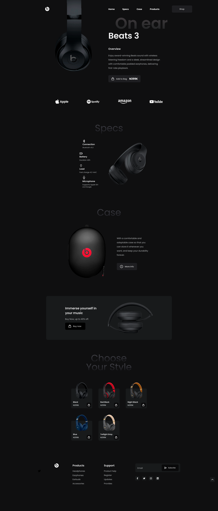

# 🎧 Beats Landing Page

A modern, responsive **Beats headphones landing page** built using **HTML** and **Tailwind CSS**. This project showcases a sleek UI design with smooth hover effects, responsive layouts, and product-focused sections.

---

## 🚀 Features

* ⚡ Fully responsive design (Desktop, Tablet, Mobile)
* 🎨 Modern UI with gradient text and dark theme
* 🖱️ Interactive hover animations
* 📱 Mobile-friendly navigation (hamburger menu)
* 🛍️ Product showcase with pricing cards
* 🔊 Specifications and features section
* 📦 Call-to-action (Buy Now / Add to Bag)
* 🌐 Integrated brand logos (Spotify, Apple, YouTube, Amazon)

---

## 🛠️ Technologies Used

* **HTML5**
* **Tailwind CSS (CDN)**
* **Font Awesome Icons**
* **Google Fonts**

  * Poppins
  * Montserrat
  * Inter
  * Michroma
  * Orbitron
preview


---

## 📂 Project Structure

```
Beats-Landing-Page/
│
├── index.html
├── Photos/
│   ├── mainImage.png
│   ├── specsImage.png
│   ├── caseImage.png
│   ├── buyNowSectionImage.png
│   └── product images...
│
├── Icons/
│   ├── shoppingBag.png
│   ├── bluetooth.png
│   ├── battery.png
│   └── social icons...
│
└── README.md
```

---

## 📸 Sections Overview

### 🧭 Navbar

* Logo + navigation links
* Responsive hamburger menu for mobile

### 🎧 Hero Section

* Featured product (**Beats 007**)
* Gradient heading and CTA button

### 🤝 Brand Collaboration

* Logos of Spotify, Apple, YouTube, Amazon

### ⚙️ Specifications

* Bluetooth, Battery, Mic, Charging details

### 🎒 Case Section

* Product description with “More Info” button

### 💸 Offer Section

* Promotional banner with discount

### 🛒 Products Section

* Multiple product cards
* Hover effects and add-to-cart buttons

### 📩 Footer

* Support links
* Product categories
* Social media icons
* Email subscription box

---

## 📱 Responsive Design

| Device  | Status      |
| ------- | ----------- |
| Desktop | ✅ Optimized |
| Tablet  | ✅ Adjusted  |
| Mobile  | ✅ Supported |

---

## ⚙️ Setup & Usage

1. Clone the repository:

```bash
git clone https://github.com/your-username/beats-landing-page.git
```

2. Open the project folder:

```bash
cd beats-landing-page
```

3. Run the project:

* Simply open `index.html` in your browser

---

## ✨ Customization

* Update images inside the `Photos/` folder
* Modify colors using Tailwind classes
* Change fonts in the Tailwind config section
* Add more products in the product section

---

## 📌 Improvements (Future Scope)

* Add JavaScript for interactivity
* Implement real shopping cart functionality
* Add animations using Framer Motion or GSAP
* Improve accessibility (ARIA labels, contrast)
* Connect with backend (Node.js / Firebase)

---

## 📄 License

This project is open-source and free to use for learning purposes.

---

## 🙌 Acknowledgment

Inspired by modern e-commerce UI designs and headphone brand landing pages.
